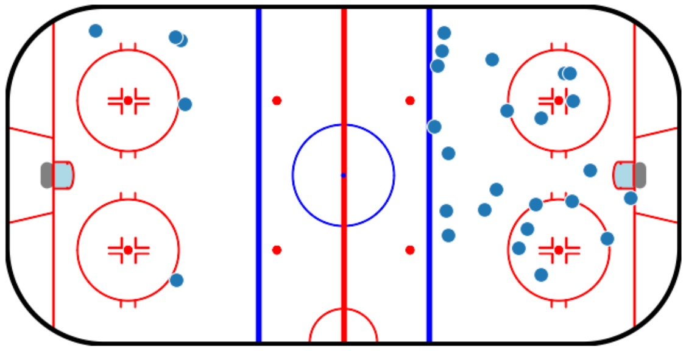

# Welcome to Challenge 2: Let's find the playmaker!



## Getting started

Explore the dataset with the notebook: **explore_the_data.ipynb**

## Apache Kafka setup

We will simulate a stream with is streaming the event data in real-time.

Kafka works better with Linux so that a Linux distribution is recommended rather than Windows.

Follow the steps to get the basic Kafka code running:

### 1. Install Docker

Setup Docker Repository

```bash
sudo apt update
sudo apt install apt-transport-https ca-certificates curl software-properties-common -y
curl -fsSL https://download.docker.com/linux/ubuntu/gpg | sudo gpg --dearmor -o /usr/share/keyrings/docker-archive-keyring.gpg
echo "deb [arch=$(dpkg --print-architecture) signed-by=/usr/share/keyrings/docker-archive-keyring.gpg] https://download.docker.com/linux/ubuntu $(lsb_release -cs) stable" | sudo tee /etc/apt/sources.list.d/docker.list > /dev/null
```

Install Docker engine

```bash
sudo apt update
sudo apt install docker-ce docker-ce-cli containerd.io -y
```

Add Docker to username

```bash
sudo groupadd docker
sudo usermod -aG docker <username>
docker run hello world
```

Install Docker Compose

```bash
sudo curl -L "https://github.com/docker/compose/releases/download/v2.0.1/docker-compose-$(uname -s)-$(uname -m)" -o /usr/local/bin/docker-compose
sudo chmod +x /usr/local/bin/docker-compose
docker compose --version
docker compose up -d
```

With **docker composer up -d** the services should be started.

Test if all services are running with:

```bash
docker ps
```

To access the Kafka UI you can type in your browser: **localhost:8080**

### 2. Create virtual environment

Create a new virtual environment, activate it and install confluent-kafka

```bash
python3 -m venv venv
source venv/bin/activate
pip install confluent-kafka
```

### 4. Start data stream

The file: **Producer.py** is simulating the data stream which you can start with:

```bash
python Producer.py
```

Open your Browser and type: `<code>` localhost:8080`</code>`. The Kafka UI should open where you can see the Brokers, Topics with the messages and the Consumer.

### 5. Write your first worker

A worker is a little agent which is reading the data stream, doing some calculations and writing the results into a different topic.

For example every time you have a ShotEvent you want to calculate the average distance of the defenders to the player who shot the puck.
The result you want to write into a new topic with the name: **ShotPressure** with the data:

- Timestamp
- PlayerID who shot
- Average distance of the defenders to the player.
- Position of the player who shot.
- Goal or No Goal.

In your next worker you can just consume the messages of this topic and make further calculations.

`<code>`worker.py `</code>` gives you an example how to consume the messages from a specific topic.
